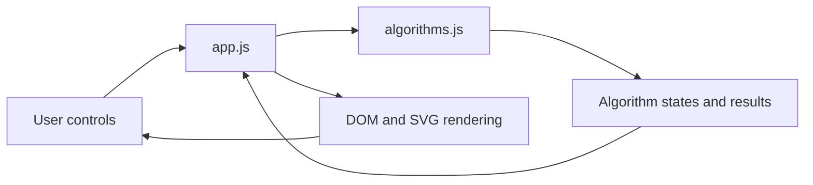
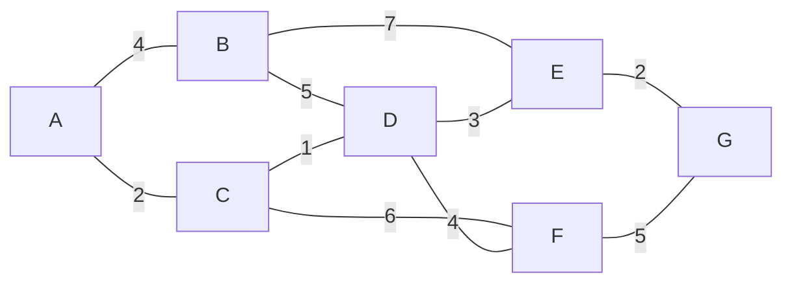

<div align="center">

# Algorithms & Data Structures Visualizer

An interactive browser application for exploring sorting algorithms, graph traversal, shortest paths, and binary search tree operations through step-by-step animation.


</div>

---

## Overview

This project turns core algorithms and data structures into interactive visual experiences.

Users can:

- watch sorting algorithms process an array one operation at a time;
- compare sorting behavior using live comparison and move counters;
- animate breadth-first search, depth-first search, and Dijkstra's algorithm;
- choose any graph node as the traversal source;
- insert, search, and delete values in a binary search tree;
- inspect the tree's in-order traversal and current height.

The algorithm implementations are separated from the DOM and rendering code, making the core logic independently testable.

## Features

### Sorting Visualizer

- Bubble Sort
- Selection Sort
- Insertion Sort
- Adjustable array size
- Adjustable animation speed
- Random array generation
- Reset to the original array
- Live comparison counter
- Live move counter
- Active-element highlighting
- Completed-array state

### Graph Visualizer

- Breadth-First Search
- Depth-First Search
- Dijkstra's shortest-path algorithm
- Selectable starting node
- Animated visit order
- Weighted, undirected sample graph
- Final shortest-distance output for Dijkstra

### Binary Search Tree Visualizer

- Insert integer values
- Reject duplicate values
- Search with path highlighting
- Delete leaf nodes
- Delete nodes with one child
- Delete nodes with two children
- Display in-order traversal
- Display current tree height
- Reset the complete tree
- Validate values from 0 to 99

## How It Works



`src/algorithms.js` contains pure algorithm and data-structure logic.

`src/app.js` handles:

- page tabs;
- user controls;
- animation timing;
- DOM updates;
- SVG graph rendering;
- SVG tree rendering;
- status messages and counters.

This separation keeps the visual layer independent from the algorithm layer and allows the logic to be tested without opening a browser.

## Algorithms Included

### Sorting

#### Bubble Sort

- Best case: `O(n)`
- Average case: `O(n^2)`
- Worst case: `O(n^2)`
- Extra space: `O(1)`
- Optimization: stops early when a full pass makes no swaps

#### Selection Sort

- Best, average, and worst case: `O(n^2)`
- Extra space: `O(1)`

#### Insertion Sort

- Best case: `O(n)`
- Average case: `O(n^2)`
- Worst case: `O(n^2)`
- Extra space: `O(1)`

The counters represent operations recorded by this implementation:

- a **comparison** is recorded whenever two values are compared;
- a **move** is recorded for a swap in Bubble or Selection Sort;
- Insertion Sort records shifted values and the final placement of the current value as moves.

### Graph Algorithms

#### Breadth-First Search

Uses a queue to visit nodes level by level from the selected start node.

- Time complexity: `O(V + E)`
- Space complexity: `O(V)`

#### Depth-First Search

Uses recursive traversal to follow each path before backtracking.

- Time complexity: `O(V + E)`
- Space complexity: `O(V)`

#### Dijkstra's Algorithm

Finds shortest distances from one start node in the included non-negative weighted graph.

- Current implementation: linear scan for the nearest unvisited node
- Time complexity: `O(V^2 + E)`
- Space complexity: `O(V)`

> Dijkstra's algorithm requires non-negative edge weights. The graph included in this project satisfies that requirement.

### Binary Search Tree

The tree supports insertion, search, deletion, in-order traversal, and height calculation.

Average performance is `O(log n)` for insert, search, and delete when the tree is reasonably balanced. Worst-case performance is `O(n)` because this is an unbalanced binary search tree.

For a node with two children, deletion replaces the node's value with its in-order successor and then removes that successor from the right subtree.

## Quick Start

### Requirements

- A modern browser
- Python 3 for the provided local server command
- Node.js for running the tests

No frontend framework, package installation, bundler, or build step is required.

### Clone the repository

```bash
git clone https://github.com/awmiryaw/algorithms-data-structures-visualizer.git
cd algorithms-data-structures-visualizer
```

### Start the local server

Using the included npm script:

```bash
npm start
```

Or directly with Python:

```bash
python3 -m http.server 8000
```

Then open:

```text
http://localhost:8000
```

A local server is recommended because the project uses JavaScript ES modules.

## Using the Visualizer

### Run a sorting algorithm

1. Open the **Sorting** tab.
2. Choose Bubble Sort, Selection Sort, or Insertion Sort.
3. Adjust the array size and animation speed.
4. Select **Start**.
5. Watch the active bars, comparisons, and moves.
6. Use **Reset** to restore the original array or **New Array** to generate another one.

### Run a graph algorithm

1. Open the **Graphs** tab.
2. Choose BFS, DFS, or Dijkstra.
3. Select a starting node from A to G.
4. Select **Run**.
5. Follow the highlighted nodes and visit order.
6. For Dijkstra, inspect the final distance to every reachable node.

### Use the binary search tree

1. Open the **Binary Search Tree** tab.
2. Enter an integer from 0 to 99.
3. Choose **Insert**, **Search**, or **Delete**.
4. Inspect the highlighted search path, in-order traversal, and tree height.
5. Use **Reset** to clear the tree.

The application starts with this example tree:

```text
50, 30, 70, 20, 40, 60, 80
```

## Sample Graph

The graph visualizer uses seven nodes and weighted undirected edges.



Starting Dijkstra's algorithm from node `A` produces these shortest distances:

```text
A: 0, B: 4, C: 2, D: 3, E: 6, F: 7, G: 8
```

## Testing

Run the test suite with:

```bash
npm test
```

The tests use Node.js built-in assertions and cover:

- final output of all three sorting algorithms;
- BFS traversal;
- DFS traversal;
- Dijkstra shortest distances;
- BST insertion;
- duplicate rejection;
- in-order traversal;
- tree height;
- successful and unsuccessful search;
- deletion;
- unsuccessful deletion.

Expected final output:

```text
All tests passed.
```

## Repository Structure

| Path | Purpose |
|---|---|
| `index.html` | Application layout and interactive controls |
| `styles.css` | Responsive styling, animation states, and visual presentation |
| `src/algorithms.js` | Sorting, graph, and binary search tree logic |
| `src/app.js` | DOM interaction, animation, and SVG rendering |
| `tests/algorithms.test.js` | Automated tests for the algorithm layer |
| `package.json` | Project metadata and start/test scripts |
| `.github/workflows/tests.yml` | Automated test workflow |
| `README.md` | Project documentation |

## Design Decisions

### Pure algorithm functions

Sorting functions return a sequence of immutable snapshots rather than manipulating the interface directly. Each snapshot contains:

```javascript
{
  array,
  active,
  comparisons,
  moves,
  done
}
```

This makes the sorting process easy to animate and easy to test.

### Adjacency-list graph

The graph is represented as an adjacency list whose edges contain:

```javascript
{
  node,
  weight
}
```

The same graph representation supports BFS, DFS, and Dijkstra.

### SVG rendering

Graph and tree nodes are rendered with SVG elements. SVG is well suited to:

- connecting nodes with lines;
- positioning labels;
- changing node states through CSS classes;
- scaling inside a responsive interface.

### Recursive BST deletion

The deletion operation handles the three standard cases:

1. no child;
2. one child;
3. two children.

The two-child case uses the smallest value in the right subtree as the successor.

## Current Scope

This project intentionally focuses on core visualization and algorithm logic.

It currently does not include:

- user-created graph edges;
- negative edge weights;
- path reconstruction for Dijkstra;
- self-balancing trees such as AVL or Red-Black Trees;
- pause, resume, or single-step animation controls;
- persistent browser storage;
- a frontend framework or backend API.

## Possible Improvements

- add Merge Sort and Quick Sort;
- reconstruct and highlight the actual shortest path in Dijkstra;
- allow users to create and edit graphs;
- add pause, resume, and step controls;
- display algorithm pseudocode beside each animation;
- add AVL-tree rotations;
- add keyboard and screen-reader improvements;
- test DOM behavior in addition to pure algorithm logic;
- add screenshots or a short demo GIF to the repository.

## Skills Demonstrated

- algorithm design and complexity analysis;
- arrays, queues, recursion, graphs, and trees;
- immutable visualization snapshots;
- asynchronous JavaScript animation;
- JavaScript ES modules;
- DOM manipulation;
- SVG rendering;
- responsive CSS;
- separation of concerns;
- automated testing with Node.js;
- GitHub Actions workflow integration.

## Acknowledgment

The presentation structure takes inspiration from established educational visualization projects such as Algorithm Visualizer and VisuAlgo, while the implementation in this repository is a smaller original project built with plain HTML, CSS, JavaScript, and SVG.
